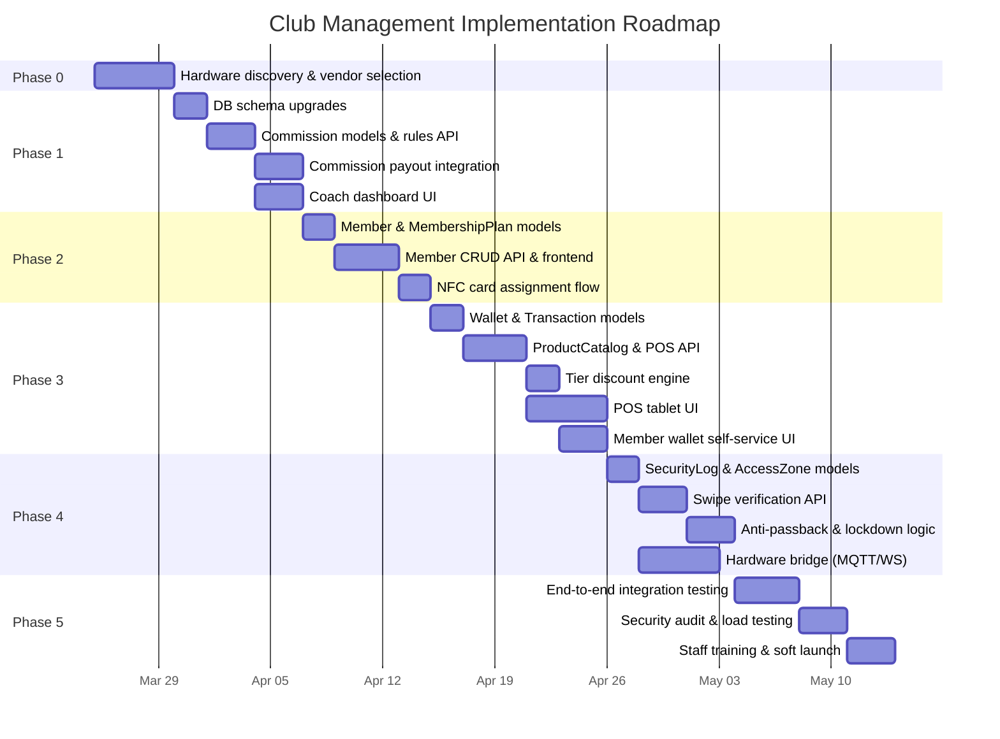

# Club Management System — Spec & Audit

## The 4-Layer System Architecture

Your documents outline a system built on four main layers, which fits perfectly into our existing stack:

---

### 1. Central Club Operating System (CCOS) 🧠

**What it is:** The central hub for the club.

**How we build it:** This is your Node.js/Express backend connected to the PostgreSQL database we already designed. It acts as the single source of truth for the "One Identity. One Card. One Account" principle.

#### Audit Status: 🟡 Partial

**✅ Already Built:**
- Multi-tenant backend (`Tenant` model — UUID, subdomain isolation, `activeModules` JSONB, `subscriptionTier`)
- User accounts (`User` model — email/password, tenant-scoped)
- RBAC (`Role` model + `UserRoles` join table, `checkPermission` middleware)
- Employee profiles (`EmployeeProfile` — name, department, position, salary, hierarchy)
- Real-time notifications (`Notification` model + WebSocket via `wsService`)
- Dynamic subscription plans (`SubscriptionPlan` model)

**🔴 Missing:**
- **Member model** — A `Member` entity distinct from `Employee`, with membership tiers (Silver $5k / Gold $10k / Platinum $50k), NFC card UID, photo, and a "one identity" profile
- **MembershipPlan table** — Tier names, pricing (up to $50k), benefits JSONB, access-zone definitions
- **NFC/Card ID field** — No field on any model to store a physical card UID
- **Member-centric frontend pages** — No member directory, membership dashboard, or member self-service portal

---

### 2. Access Control & Security Layer 🚪

**What it is:** The physical barrier keeping the non-VIPs out. It manages tier-based access, time-based rules, anti-passback, and emergency lockdowns.

**How we build it:** We need dedicated Express API endpoints (`/api/access/swipe`) that listen for pings from the club's NFC/RFID readers and Smart Door Locks. When a card is swiped, the API verifies the member's tier. If they are Platinum, they get biometric access and VIP zone entry. If they violate rules (like card sharing), the system instantly disables the card.

#### Audit Status: 🔴 Missing (Entirely New)

Nothing in the current system covers this. Required:

| Component | Description |
|---|---|
| `/api/access/swipe` endpoint | Receives NFC reader pings, verifies member tier, returns grant/deny |
| `SecurityLog` model | Logs every turnstile/door interaction: memberId, deviceId, action, result, timestamps |
| Anti-passback logic | Prevents card re-use without an exit event; disables card on violation |
| Time-based access rules | Off-peak / peak hour restrictions per tier |
| Emergency lockdown API | Global endpoint to lock/unlock all doors |
| Biometric integration | Platinum-tier biometric verification (fingerprint/face) |
| VIP zone mapping | Zone definitions with tier-based access matrix |
| Dual authentication | Off-peak access requires two forms of verification |
| CCTV integration hooks | Event triggers for camera recording on access events |
| Hardware integration layer | MQTT/WebSocket bridge for NFC readers, magnetic locks, turnstiles |

---

### 3. Cashless POS & Digital Wallet System 💳

**What it is:** The money-maker. A totally cashless system using tablet-based POS terminals and NFC readers.

**How we build it:** We activate the POS module in your SaaS. When a member taps their card to buy a drink or book a court, the backend automatically applies their tier discount: 5% for Silver, 10% for Gold, or 20% for Platinum.

#### Audit Status: 🔴 Missing (Entirely New)

The existing `Payslip` model handles money but for **employee salary**, not member transactions. `InventoryPage.jsx` exists as an empty placeholder (770 bytes). Required:

| Component | Description |
|---|---|
| `Wallet` model | memberId, balance, creditLimit, auto-top-up config |
| `Transaction` model | Every purchase: memberId, amount, discount, walletBalanceAfter, posTerminalId |
| POS API (`/api/pos/charge`) | Tap card → look up member → apply tier discount → debit wallet → return receipt |
| Tier discount engine | Silver 5%, Gold 10%, Platinum 20% — auto-applied |
| Wallet top-up API | `/api/wallet/topup` — manual or auto-refill |
| Wallet history API | `/api/wallet/history` — paginated ledger |
| `POSTerminal` model | Register/deregister tablet terminals |
| `ProductCatalog` model | Items/services for sale with prices |
| Receipt generation | Digital receipt sent to member's account |
| POS frontend page | Tablet-optimized UI for NFC tap payments |
| Member wallet page | Self-service balance, transaction history, top-up |

---

### 4. Coach, Staff & Talent Management Module 🏸

**What it is:** The payroll and commission engine. Each coach gets a unique digital ID to sell services via tap.

**How we build it:** We use your existing HR module but bolt on an auto-calculating commission engine. The database will strictly enforce the Coach Commission Matrix:

| Service Type | Coach Share | Club Share |
|---|---|---|
| Private 1-on-1 | 70% | 30% |
| Group Training | 60% | 40% |
| Elite Clinics | 50% | 50% |
| Junior Programs | 65% | 35% |

The system logs these upon every transaction and queues them for weekly or bi-weekly payouts.

#### Audit Status: 🟡 Partial

**✅ Already Built:**
- Employee profiles & hierarchy (`EmployeeProfile` with `managerId`, department, position)
- Full payroll system (`Payslip` — basic salary, allowances, deductions for SSS/PhilHealth/PagIBIG, attendance summary)
- Comprehensive payslip generation routes (`payslipRoutes.js` — 17KB)
- Attendance tracking (clock in/out, late calculations, overtime)

**🔴 Missing:**
- **Coach digital ID** — Add `staffType` (coach/staff) and `nfcCardUid` to `EmployeeProfile`
- **`CommissionRule` model** — Configure splits per service type
- **`CommissionLedger` model** — Track each commission: coachId, transactionId, serviceType, grossAmount, coachShare, clubShare, payoutStatus
- **Payout scheduling** — Weekly/bi-weekly aggregation integrated into existing Payslip flow
- **Coach dashboard page** — Frontend for coaches to view sessions, commissions, and payout history

---

## 🗄️ Database Upgrades Required

### New Models (10)

| Model | Purpose |
|---|---|
| `Member` | Club members (distinct from employees) |
| `MembershipPlan` | Silver / Gold / Platinum definitions & pricing |
| `Wallet` | Digital wallet per member |
| `Transaction` | POS purchase records |
| `SecurityLog` | Door/turnstile access event logs |
| `AccessZone` | VIP zones with tier requirements |
| `CommissionRule` | Service type → split percentage config |
| `CommissionLedger` | Per-transaction commission records |
| `POSTerminal` | Registered POS devices |
| `ProductCatalog` | Items/services available for purchase |

### Existing Models to Modify (2)

| Model | Change |
|---|---|
| `EmployeeProfile` | Add `staffType` (coach/staff), `nfcCardUid` |
| `Tenant` | Add club-specific settings (access rules, commission defaults) |

### New API Route Groups (5)

| Route Group | Key Endpoints |
|---|---|
| `/api/members` | CRUD, tier upgrade/downgrade, card assignment |
| `/api/access` | `/swipe`, `/lockdown`, `/zones` |
| `/api/wallet` | `/topup`, `/balance`, `/history` |
| `/api/pos` | `/charge`, `/terminals`, `/catalog` |
| `/api/commissions` | `/rules`, `/ledger`, `/payouts` |

---

## Effort Estimate

| Layer | Effort | Reasoning |
|---|---|---|
| 1 — CCOS (Member identity) | **Medium** | New Member + MembershipPlan models; reuses existing Tenant/User architecture |
| 2 — Access Control | **High** | Entirely new; requires hardware integration design (NFC, MQTT, locks) |
| 3 — Cashless POS | **High** | Entirely new; POS UI, wallet engine, transaction processing |
| 4 — Commission Engine | **Low–Medium** | Extends existing HR/Payroll; mostly new models + payroll hooks |

> ⚠️ **IMPORTANT:** Layers 2 and 3 require hardware integration decisions (NFC reader protocols, door lock APIs, POS terminal platform) before implementation can begin. These should be scoped in a separate technical discovery phase.

---

## 🗺️ Implementation Roadmap

### Timeline Overview

---

### Phase 0 — Discovery & Hardware Decisions ⚙️
> **~1 week** | Pre-requisite for Layers 2 & 3

| # | Task | Output |
|---|---|---|
| 0.1 | Select NFC reader hardware (e.g. ACR122U, HID iCLASS) | Vendor + protocol doc |
| 0.2 | Select smart door lock / turnstile vendor | API spec or SDK |
| 0.3 | Choose POS tablet platform (Android/iPad) | Device model + NFC capability |
| 0.4 | Define communication protocol (MQTT vs WebSocket vs REST polling) | Architecture decision record |
| 0.5 | Procurement & dev-kit ordering | Hardware in hand |

**Milestone:** Hardware dev-kits on desk, protocols documented.

---

### Phase 1 — Commission Engine (Layer 4) 🏸
> **~1.5 weeks** | Lowest risk, highest reuse of existing code

| # | Task | Details |
|---|---|---|
| 1.1 | Add `staffType` and `nfcCardUid` to `EmployeeProfile` | Sequelize migration |
| 1.2 | Create `CommissionRule` model & seed defaults | 4 service types with split percentages |
| 1.3 | Create `CommissionLedger` model | Links to transactions once POS is built |
| 1.4 | Build `/api/commissions/rules` CRUD | Admin can customize splits |
| 1.5 | Build `/api/commissions/ledger` endpoints | Log commissions on each coach sale |
| 1.6 | Build `/api/commissions/payouts` | Aggregate unpaid commissions → generate payout |
| 1.7 | Integrate payouts into existing `Payslip` generation | Add commission line items to payslip breakdown |
| 1.8 | Build Coach Dashboard page | Sessions list, commission summary, payout history |

**Milestone:** Coaches can be assigned, commission rules configured, and payouts generated through the existing payroll flow.

---

### Phase 2 — Member Identity (Layer 1) 🧠
> **~1.5 weeks** | Foundation for Layers 2 & 3

| # | Task | Details |
|---|---|---|
| 2.1 | Create `MembershipPlan` model & seed tiers | Silver ($5k) / Gold ($10k) / Platinum ($50k) |
| 2.2 | Create `Member` model | firstName, lastName, email, phone, photo, nfcCardUid, membershipPlanId, status |
| 2.3 | Build `/api/members` CRUD | Create, list, search, update, deactivate |
| 2.4 | Build tier upgrade/downgrade endpoint | `/api/members/:id/tier` with billing implications |
| 2.5 | Build NFC card assignment endpoint | `/api/members/:id/card` — assign/revoke card UID |
| 2.6 | Build Member Directory page | Searchable list with tier badges, card status |
| 2.7 | Build Member Profile page | Detailed view with history, wallet preview placeholder |
| 2.8 | Add club-specific settings to `Tenant` | Access rules defaults, commission defaults |

**Milestone:** Members can be registered, assigned tiers, and given NFC card UIDs. Member directory is live.

---

### Phase 3 — Cashless POS & Wallet (Layer 3) 💳
> **~2.5 weeks** | Revenue engine

| # | Task | Details |
|---|---|---|
| 3.1 | Create `Wallet` model | One per member; balance, creditLimit, autoTopUp config |
| 3.2 | Create `Transaction` model | Every debit/credit with full audit trail |
| 3.3 | Build `/api/wallet/topup` | Manual top-up by staff; auto-top-up trigger |
| 3.4 | Build `/api/wallet/balance` & `/history` | Balance check + paginated transaction ledger |
| 3.5 | Create `ProductCatalog` model | Items/services with category, price, availability |
| 3.6 | Build `/api/pos/catalog` CRUD | Manage products & services |
| 3.7 | Create `POSTerminal` model | Register tablet terminals |
| 3.8 | Build `/api/pos/charge` — the core transaction | Card tap → member lookup → tier discount → wallet debit → commission log → receipt |
| 3.9 | Build tier discount engine | Auto-apply: Silver 5%, Gold 10%, Platinum 20% |
| 3.10 | Build POS Tablet UI | Touch-optimized, NFC-ready, real-time receipt display |
| 3.11 | Build Member Wallet self-service page | Balance, history, request top-up |
| 3.12 | Wire commission ledger to POS transactions | Every coach-service sale auto-logs commission split |

**Milestone:** Fully cashless transactions. Members tap card → discount applied → wallet debited → receipt shown → commission logged.

---

### Phase 4 — Access Control & Security (Layer 2) 🚪
> **~2 weeks** | Hardware-dependent

| # | Task | Details |
|---|---|---|
| 4.1 | Create `AccessZone` model | Define zones: Main Floor, VIP Lounge, Courts, etc. with required tier |
| 4.2 | Create `SecurityLog` model | Every swipe event with full context |
| 4.3 | Build hardware bridge service | MQTT/WebSocket listener for NFC reader events |
| 4.4 | Build `/api/access/swipe` | Verify member → check tier vs zone → check time rules → grant/deny → log |
| 4.5 | Implement anti-passback logic | Track entry/exit state; auto-disable card on violation |
| 4.6 | Build `/api/access/lockdown` | Emergency lock/unlock all doors |
| 4.7 | Build `/api/access/zones` CRUD | Admin manages zone definitions |
| 4.8 | Implement time-based access rules | Peak/off-peak restrictions per tier |
| 4.9 | Implement dual authentication for off-peak | Card + PIN or card + biometric |
| 4.10 | Build Security Dashboard page | Live access feed, violation alerts, zone map |
| 4.11 | CCTV integration hooks | Trigger recording on swipe events (webhook to NVR) |

**Milestone:** Physical access fully controlled by tier. Anti-passback active. Emergency lockdown operational.

---

### Phase 5 — Integration, Testing & Launch 🚀
> **~2 weeks** | Quality gate

| # | Task | Details |
|---|---|---|
| 5.1 | End-to-end flow testing | Member registers → gets card → enters club → buys drink → coach earns commission → payout |
| 5.2 | Load testing | Simulate 500+ concurrent swipes and POS transactions |
| 5.3 | Security audit | OWASP top-10 review on all new endpoints |
| 5.4 | Wallet edge cases | Insufficient balance, double-charge prevention, refund flow |
| 5.5 | Anti-passback stress test | Simultaneous entry attempts, card-sharing scenarios |
| 5.6 | Staff training materials | Admin guide, coach guide, front-desk SOP |
| 5.7 | Soft launch (invite-only) | 50-member pilot with all 4 layers active |
| 5.8 | Bug fixes from pilot feedback | Rapid iteration |
| 5.9 | Full launch | Open to all members |

**Milestone:** System fully operational with all 4 layers live.

---

### Roadmap Summary

| Phase | Duration | Depends On | Key Deliverable |
|---|---|---|---|
| 0 — Discovery | ~1 week | — | Hardware selected, protocols documented |
| 1 — Commission | ~1.5 weeks | Phase 0 (soft) | Coach commission engine live in payroll |
| 2 — Members | ~1.5 weeks | Phase 0 | Member identity system with NFC card UIDs |
| 3 — POS/Wallet | ~2.5 weeks | Phase 2 | Cashless tap-to-pay with tier discounts |
| 4 — Access Control | ~2 weeks | Phase 2 + hardware | Physical access control with anti-passback |
| 5 — Launch | ~2 weeks | Phases 1–4 | Full integration tested and live |
| **Total** | **~10–11 weeks** | | **Full club management system** |

> 💡 **Note:** Phases 3 and 4 can run **in parallel** after Phase 2 completes, potentially shaving 2 weeks off the total timeline (down to ~8–9 weeks).
