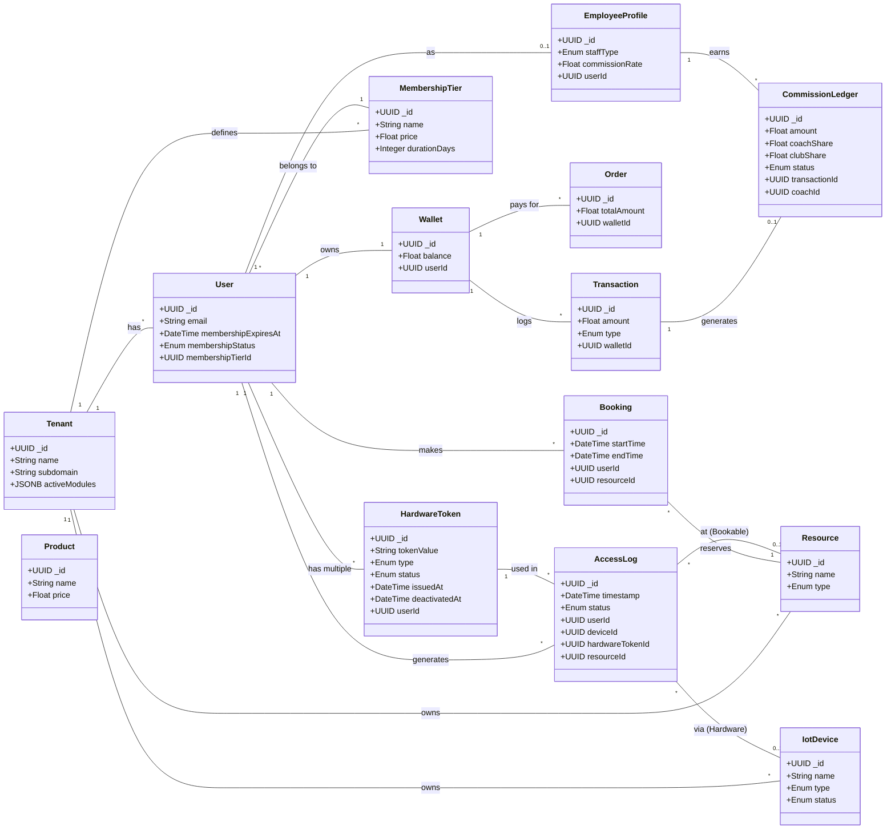

# Club Management Module Architecture (Enterprise Edition)

This diagram illustrates the core entities and their relationships within the Club Management module, featuring enterprise-grade hardware identity management.

## Fixes Applied

1.  **Enterprise Hardware Identity**: Replaced the single `rfidCardNumber` on `User` with a dedicated `HardwareToken` table. This allows members to have multiple tokens over time (LOST, REVOKED, ACTIVE) while preserving historical access logs.
2.  **Membership Lifecycle**: `membershipStatus` and `membershipExpiresAt` track the validity of the member's access.
3.  **Coach Commissions**: `CommissionLedger` automates the fee splitting for trainers and staff.
4.  **Physical Separation**: `IotDevice` (hardware) is separate from `Resource` (bookable events).

