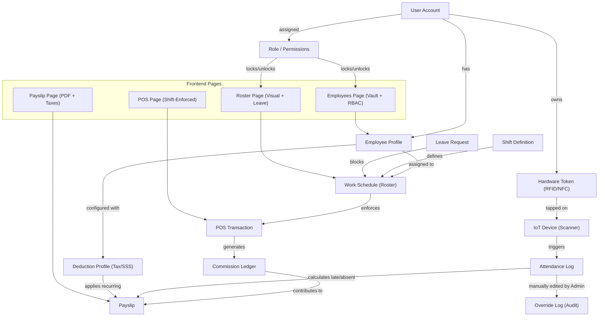

# HR Module Architecture Diagram (Final Refinement)

The following diagram illustrates the complete HR ecosystem, including IoT hardware (RFID/Scanner), RBAC (The Bouncer), and tax-compliant payroll engine.

### Key Functional Improvements
- **Hardware Integration**: The system now explicitly validates `HardwareToken` status and logs the specific `IotDevice` (Scanner) for every punch.
- **Deduction Profiles**: Employees can have fixed recurring deductions (Withholding Tax, SSS, PhilHealth, Pag-IBIG) which override or supplement standard calculations.
- **RBAC (The Bouncer)**: Frontend actions like "Add Employee" or "Assign Shift" are gated by `manage_employees` and `manage_schedules` permissions.
- **Payroll Automation**: Deductions for lates and absences are automatically calculated based on `AttendanceLog` and `WorkSchedule` comparison.
