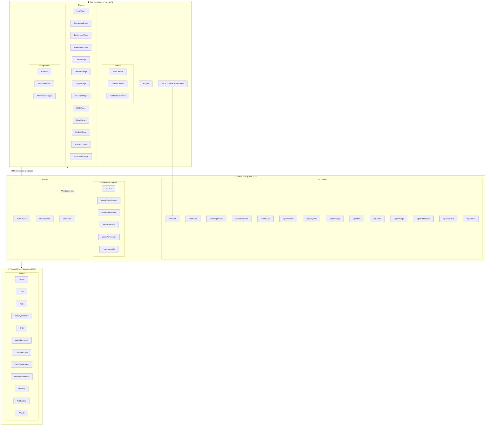
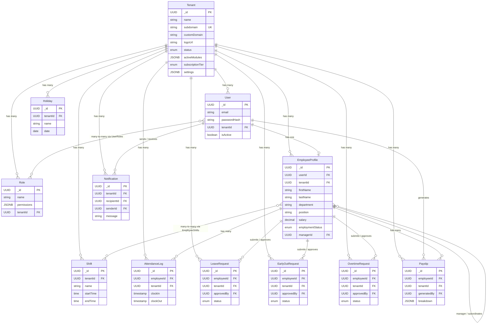
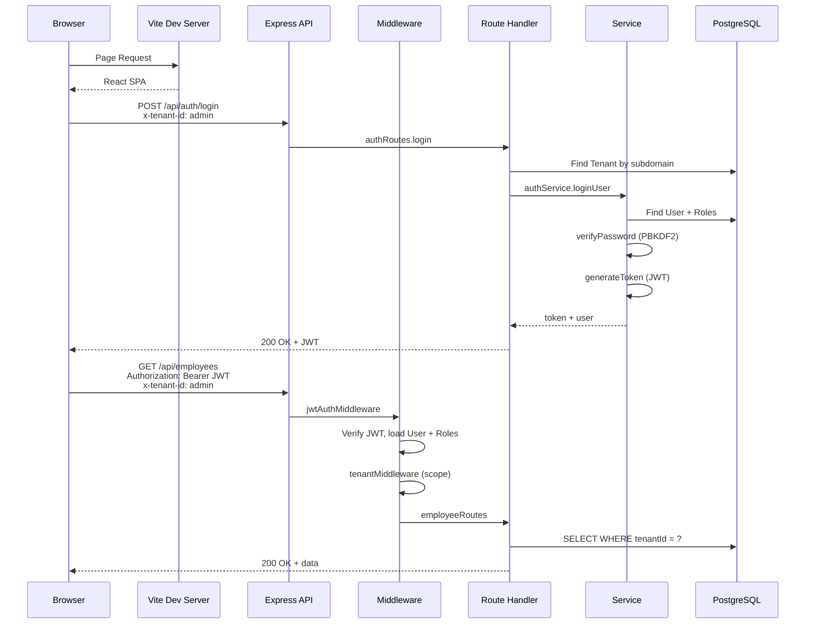
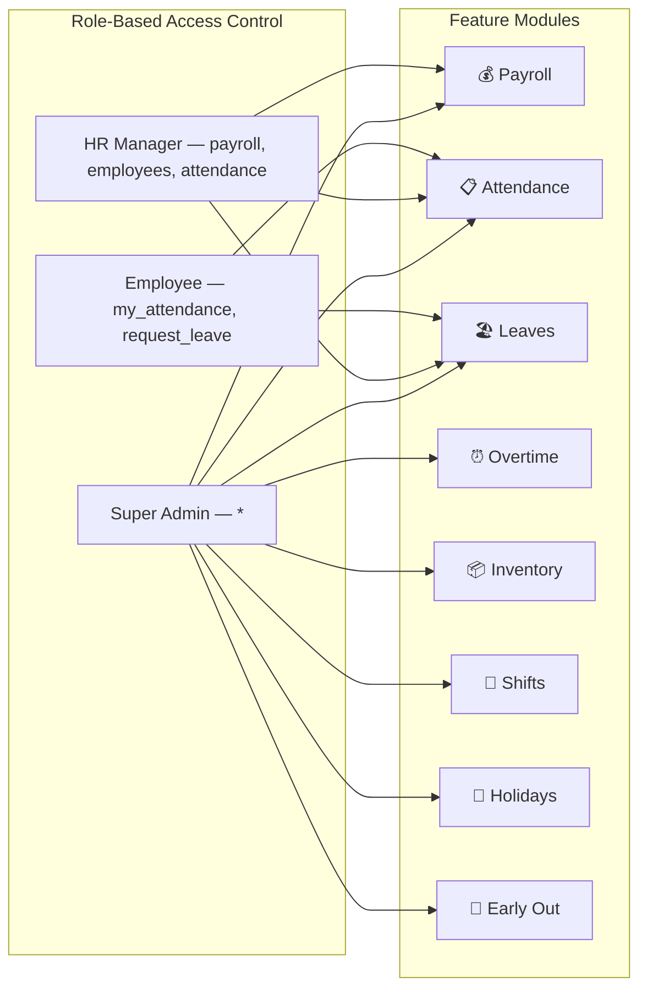

# Office Management SaaS — System Architecture

## High-Level Architecture

```mermaid
graph TB
    subgraph Client["🖥️ Client — React + Vite :5174"]
        direction TB
        App["App.jsx"]
        
        subgraph Contexts["Contexts"]
            AuthCtx["AuthContext"]
            TenantCtx["TenantContext"]
            NotifCtx["NotificationContext"]
        end
        
        subgraph Pages["Pages"]
            Login["LoginPage"]
            Dash["DashboardPage"]
            Emp["EmployeesPage"]
            Att["AttendancePage"]
            Leaves["LeavesPage"]
            OT["OvertimePage"]
            Pay["PayslipPage"]
            Hol["HolidaysPage"]
            Shifts["ShiftsPage"]
            Roles["RolesPage"]
            Settings["SettingsPage"]
            Inv["InventoryPage"]
            SAdmin["SuperAdminPage"]
        end
        
        subgraph Components["Components"]
            Sidebar["Sidebar"]
            NotifBell["NotificationBell"]
            FeatureToggle["withFeatureToggle"]
        end
        
        ApiService["api.js — Axios Interceptors"]
    end
    
    subgraph Server["⚙️ Server — Express :5000"]
        direction TB
        
        subgraph Middleware["Middleware Pipeline"]
            CORS["CORS"]
            JWT["jwtAuthMiddleware"]
            TenantMW["tenantMiddleware"]
            TenantRes["tenantResolver"]
            Perms["checkPermission"]
            ModReq["requireModule"]
        end
        
        subgraph Routes["API Routes"]
            AuthR["/api/auth"]
            UserR["/api/users"]
            EmpR["/api/employees"]
            AttR["/api/attendance"]
            LeaveR["/api/leaves"]
            OTR["/api/overtime"]
            PayR["/api/payslips"]
            HolR["/api/holidays"]
            ShiftR["/api/shifts"]
            RoleR["/api/roles"]
            SetR["/api/settings"]
            NotifR["/api/notifications"]
            EarlyR["/api/early-out"]
            AdminR["/api/admin"]
        end

        subgraph Services["Services"]
            AuthSvc["authService"]
            LeaveSvc["leaveService"]
            WsSvc["wsService"]
        end
    end

    subgraph DB["🐘 PostgreSQL — Sequelize ORM"]
        direction TB
        
        subgraph Models["Models"]
            Tenant_M["Tenant"]
            User_M["User"]
            Role_M["Role"]
            EmpProf_M["EmployeeProfile"]
            Shift_M["Shift"]
            AttLog_M["AttendanceLog"]
            LeaveReq_M["LeaveRequest"]
            EarlyOut_M["EarlyOutRequest"]
            OTReq_M["OvertimeRequest"]
            Holiday_M["Holiday"]
            Notif_M["Notification"]
            Payslip_M["Payslip"]
        end
    end

    Client -->|"HTTP + x-tenant-id header"| Server
    Client <-->|"WebSocket /ws"| WsSvc
    ApiService --> AuthR
    Server --> DB
```

## Entity Relationship Diagram

```mermaid
erDiagram
    Tenant ||--o{ User : "has many"
    Tenant ||--o{ Role : "has many"
    Tenant ||--o{ EmployeeProfile : "has many"
    Tenant ||--o{ Shift : "has many"
    Tenant ||--o{ AttendanceLog : "has many"
    Tenant ||--o{ LeaveRequest : "has many"
    Tenant ||--o{ EarlyOutRequest : "has many"
    Tenant ||--o{ OvertimeRequest : "has many"
    Tenant ||--o{ Holiday : "has many"
    Tenant ||--o{ Notification : "has many"
    Tenant ||--o{ Payslip : "has many"

    User }o--o{ Role : "many-to-many via UserRoles"
    User ||--o| EmployeeProfile : "has one"
    User ||--o{ Notification : "sends / receives"
    User ||--o{ Payslip : "generates"

    EmployeeProfile ||--o{ AttendanceLog : "has many"
    EmployeeProfile }o--o{ Shift : "many-to-many via EmployeeShifts"
    EmployeeProfile ||--o{ LeaveRequest : "submits / approves"
    EmployeeProfile ||--o{ EarlyOutRequest : "submits / approves"
    EmployeeProfile ||--o{ OvertimeRequest : "submits / approves"
    EmployeeProfile ||--o{ Payslip : "has many"
    EmployeeProfile ||--o{ EmployeeProfile : "manager / subordinates"

    Tenant {
        UUID _id PK
        string name
        string subdomain UK
        string customDomain
        string logoUrl
        enum status
        JSONB activeModules
        enum subscriptionTier
        JSONB settings
    }

    User {
        UUID _id PK
        string email
        string passwordHash
        UUID tenantId FK
        boolean isActive
    }

    Role {
        UUID _id PK
        string name
        JSONB permissions
        UUID tenantId FK
    }

    EmployeeProfile {
        UUID _id PK
        UUID userId FK
        UUID tenantId FK
        string firstName
        string lastName
        string department
        string position
        decimal salary
        enum employmentStatus
        UUID managerId FK
    }

    Shift {
        UUID _id PK
        UUID tenantId FK
        string name
        time startTime
        time endTime
    }

    AttendanceLog {
        UUID _id PK
        UUID employeeId FK
        UUID tenantId FK
        timestamp clockIn
        timestamp clockOut
    }

    LeaveRequest {
        UUID _id PK
        UUID employeeId FK
        UUID tenantId FK
        UUID approvedBy FK
        enum status
    }

    EarlyOutRequest {
        UUID _id PK
        UUID employeeId FK
        UUID tenantId FK
        UUID approvedBy FK
        enum status
    }

    OvertimeRequest {
        UUID _id PK
        UUID employeeId FK
        UUID tenantId FK
        UUID approvedBy FK
        enum status
    }

    Holiday {
        UUID _id PK
        UUID tenantId FK
        string name
        date date
    }

    Notification {
        UUID _id PK
        UUID tenantId FK
        UUID recipientId FK
        UUID senderId FK
        string message
    }

    Payslip {
        UUID _id PK
        UUID employeeId FK
        UUID tenantId FK
        UUID generatedBy FK
        JSONB breakdown
    }
```

## Request Flow

```mermaid
sequenceDiagram
    participant Browser
    participant Vite as Vite Dev Server
    participant API as Express API
    participant MW as Middleware
    participant Route as Route Handler
    participant Svc as Service
    participant DB as PostgreSQL

    Browser->>Vite: Page Request
    Vite-->>Browser: React SPA

    Browser->>API: POST /api/auth/login<br/>x-tenant-id: admin
    API->>Route: authRoutes.login
    Route->>DB: Find Tenant by subdomain
    Route->>Svc: authService.loginUser
    Svc->>DB: Find User + Roles
    Svc->>Svc: verifyPassword (PBKDF2)
    Svc->>Svc: generateToken (JWT)
    Svc-->>Route: token + user
    Route-->>Browser: 200 OK + JWT

    Browser->>API: GET /api/employees<br/>Authorization: Bearer JWT<br/>x-tenant-id: admin
    API->>MW: jwtAuthMiddleware
    MW->>MW: Verify JWT, load User + Roles
    MW->>MW: tenantMiddleware (scope)
    MW->>Route: employeeRoutes
    Route->>DB: SELECT WHERE tenantId = ?
    Route-->>Browser: 200 OK + data
```

## Module Access Control

```mermaid
graph LR
    subgraph RBAC["Role-Based Access Control"]
        SA["Super Admin — *"]
        HR["HR Manager — payroll, employees, attendance"]
        EMP["Employee — my_attendance, request_leave"]
    end
    
    subgraph Modules["Feature Modules"]
        Payroll["💰 Payroll"]
        Attendance["📋 Attendance"]
        Leaves["🏖️ Leaves"]
        Overtime["⏰ Overtime"]
        Inventory["📦 Inventory"]
        Shifts["🔄 Shifts"]
        Holidays["📅 Holidays"]
        EarlyOut["🚪 Early Out"]
    end
    
    SA --> Payroll
    SA --> Attendance
    SA --> Leaves
    SA --> Overtime
    SA --> Inventory
    SA --> Shifts
    SA --> Holidays
    SA --> EarlyOut
    
    HR --> Payroll
    HR --> Attendance
    HR --> Leaves
    
    EMP --> Attendance
    EMP --> Leaves
```
